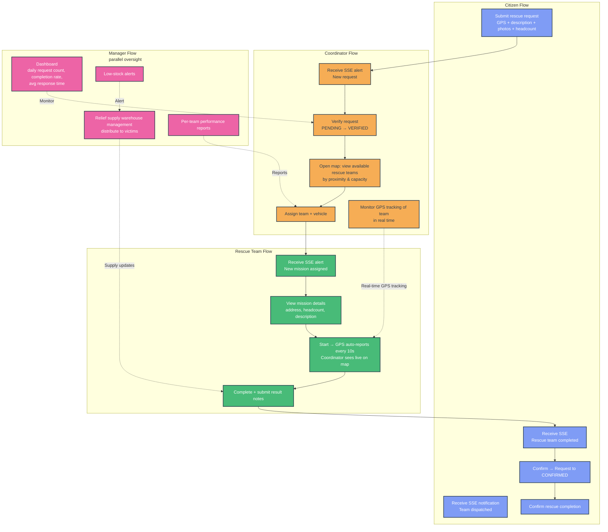
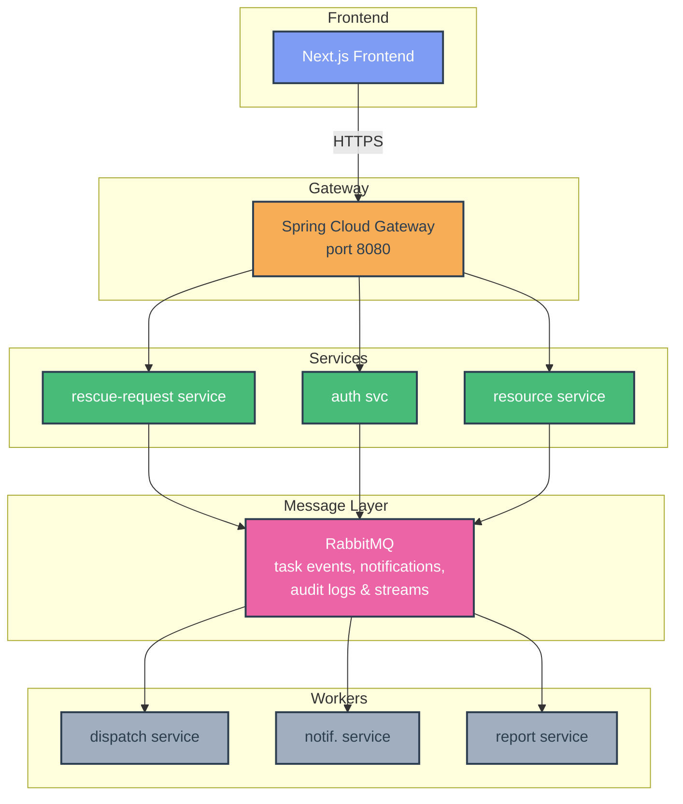

# FLOOD RESCUE COORDINATION & RELIEF MANAGEMENT SYSTEM

> A microservices platform built for real flood emergency scenarios — coordinating rescue requests, team dispatching, GPS tracking, relief supply management, and real-time operations monitoring across 5 actor roles.

[](https://spring.io/projects/spring-boot)
[](https://nextjs.org)
[](https://www.docker.com)
[](https://www.rabbitmq.com)
[](https://github.com/features/actions)

> 🚧 **Active Development** — Sprint 1 complete. Currently in **Sprint 2** (10 Mar – 18 Mar): microservices extraction done, frontend UI implementation in progress.

---

## Context

Flood disasters in Vietnam suffer from a coordination gap: rescue requests come in through informal channels, teams are dispatched manually, and relief supply tracking is done on paper. This system centralizes the entire operation — from a citizen submitting a GPS-tagged rescue request to a coordinator dispatching the nearest available team, tracked live on a map.

**This is a 6-person team project.** As Tech Lead, my responsibilities cover: architecture decisions, tech stack selection, microservices module skeleton setup (frontend + backend), full infrastructure configuration, CI/CD pipeline, and sprint management via Jira.

---

## Operational Flow

The system supports 5 actor roles with distinct workflows that connect end-to-end:



---

## Architecture

### Microservices Extraction — Complete

The system started as a modular monolith to validate business logic and service boundaries first. **As of Sprint 2, all services have been fully extracted** into independently deployable microservices — business services (FRS-192) and Auth Service + API Gateway (FRS-191) are both done.

Each service owns its own database (Database per Service pattern), communicates asynchronously via RabbitMQ, and is independently deployable.



**Message flow:**
- `rescue-request-service` → **RabbitMQ** → `dispatch-service` (new request ready for assignment)
- `dispatch-service` → **RabbitMQ** → `notification-service` (status updates to citizens & teams via SSE)
- All services → **RabbitMQ** → `report-service` (event streaming for analytics & audit logs)

---

## Microservices

| Service | Responsibility | Port |
|:--------|:--------------|:----:|
| `gateway` | Spring Cloud Gateway — primary entry point, routing | 8080 |
| `auth-service` | Auth, user management, RBAC | 8081 |
| `rescue-request-service` | Submit, verify, classify, track requests | 8082 |
| `dispatch-service` | Assign teams & vehicles, GPS tracking | 8083 |
| `resource-service` | Vehicle fleet & relief supply inventory | 8084 |
| `notification-service` | SSE delivery (RabbitMQ consumer) | 8085 |
| `report-service` | Statistics, performance reports (RabbitMQ consumer) | 8086 |

---

## Tech Stack

```
Frontend          Next.js · React · TypeScript
                  Tailwind CSS · Shadcn/UI
                  Google Maps API / Leaflet.js

Backend           Spring Boot (Java 21 Temurin) — per service
                  JPA/Hibernate · MySQL (per service)
                  Spring Security · JWT
                  Spring Cloud Gateway

Messaging         RabbitMQ — task events, notifications & audit logs

Infrastructure    Spring Cloud Gateway (reverse proxy / entry point)
                  Docker + Docker Compose
                  VPS (Ubuntu) deployment
                  GitHub Actions (CI/CD)
```

---

## Performance & Optimization

Running 7 microservices on budget VPS hardware requires deliberate memory management. The following tuning makes the system production-viable without requiring expensive infrastructure.

### JVM Memory Tuning

Each backend service runs with explicit JVM flags to minimize heap footprint:

```
-Xmx256m                  # Hard cap per service
-XX:+UseSerialGC           # Lightweight GC — no parallel GC threads
-XX:TieredStopAtLevel=1   # Skip JIT optimization tiers 2-4 (faster startup, lower memory)
```

### Results

| Service | Initial RAM | Optimized RAM | Reduction |
|:--------|:-----------:|:-------------:|:---------:|
| Backend services (avg) | > 400 MB | 180 – 330 MB | ~40% |

### Docker Resource Limits

Each container is capped at **400 MB memory** via `docker-compose` resource constraints, preventing any single service from destabilizing the host under load.

### Dockerfile Layer Caching

Maven dependencies are cached in a dedicated layer, so rebuilds only re-download artifacts when `pom.xml` changes:

```dockerfile
# Dependencies layer — only re-fetches when pom.xml changes
COPY pom.xml .
RUN mvn dependency:go-offline -B

# Source layer — rebuilt on code changes only
COPY src ./src
RUN mvn package -DskipTests
```

---

## Infrastructure & CI/CD

Infrastructure is fully configured and deployed. The pipeline triggers on every push to `main`:

```
Push to main
  │
  ├── Build Docker images (per service)
  ├── Push to Docker Hub
  └── SSH into VPS → docker compose up -d
```

### Local Development Setup

```bash
# Clone
git clone https://github.com/longtq2501/Flood-Rescue-Coordination-and-Relief-Management-System.git
cd Flood-Rescue-Coordination-and-Relief-Management-System

# Start infrastructure (MySQL, RabbitMQ, Zookeeper)
docker compose -f docker-compose.infra.yml up -d

# Backend (repeat per service — services are at root level)
cd auth-service && mvn spring-boot:run

# Frontend
cd frontend && npm install && npm run dev
```

> **Build tip:** Use `docker-compose build --parallel 2` to limit concurrent builds and prevent CPU thrashing on dev machines.

### Health Checks

All services include Docker health checks for automated container recovery. If a service fails its health check, Docker automatically restarts it without manual intervention.

### Production Deployment (VPS)

**Recommended spec:** 8 GB RAM minimum for stable multi-service operation.

```bash
# On VPS
git clone ... /opt/flood-rescue
cd /opt/flood-rescue
docker compose -f docker-compose.prod.yml up -d --build
```

Spring Cloud Gateway routes requests by path prefix to the appropriate service. HTTPS via Let's Encrypt + Certbot.

---

## Project Structure

```
flood-rescue-system/
├── gateway/
├── auth-service/
├── rescue-request-service/
├── dispatch-service/
├── resource-service/
├── notification-service/
├── report-service/
├── frontend/
├── infrastructure/
│   ├── nginx/nginx.conf
│   └── rabbitmq/rabbitmq-config.yml
├── docs/
├── docker-compose.infra.yml
├── docker-compose.prod.yml
└── .github/workflows/deploy.yml
```

---

## Team & Workflow

**Team size:** 6 members  
**Project management:** Jira (sprint planning, task breakdown, progress tracking)  
**Branching strategy:** `feature/*` → `develop` → `main` (merge on sprint completion)

**Tech Lead responsibilities (Tôn Quỳnh Long):**
- Architecture design & service boundary decisions
- Tech stack selection
- Module skeleton setup — frontend features, backend service structure
- Full infrastructure configuration (Docker, RabbitMQ)
- JVM & container performance tuning
- CI/CD pipeline setup (GitHub Actions → VPS)
- Sprint planning & task delegation via Jira

Team members are currently implementing features within the established skeleton across all services and the frontend.

---

## Development Status

**Current sprint:** FRS Sprint 2 · 10 Mar – 18 Mar

| Area | Status |
|:-----|:------:|
| Architecture & service boundaries | ✅ Complete |
| Infrastructure (Docker, RabbitMQ) | ✅ Optimized |
| Performance tuning (JVM + containers) | ✅ Complete |
| CI/CD pipeline | ✅ Complete |
| Microservices extraction (all services) | ✅ Complete |
| Unit tests — all services | ✅ Complete |
| Frontend — Coordinator UI | 🚧 In Progress |
| Frontend — Citizen UI | 🚧 In Progress |
| Frontend — Rescue Team UI | ⏳ To Do |
| Frontend — Manager UI | ⏳ To Do |
| Integration testing | ⏳ Planned |
| Production deployment | ⏳ Post Sprint 2 |

---

## Author & Contact

**Tôn Quỳnh Long** — Third-year IT student, Tech Lead  
Concurrently maintaining [Tutor Pro](https://github.com/longtq2501/Tutor-Pro) — a solo full-stack production project.

📧 tonquynhlong05@gmail.com  
🔗 [GitHub](https://github.com/longtq2501) · [LinkedIn](https://www.linkedin.com/in/ton-quynh-long-dev)
